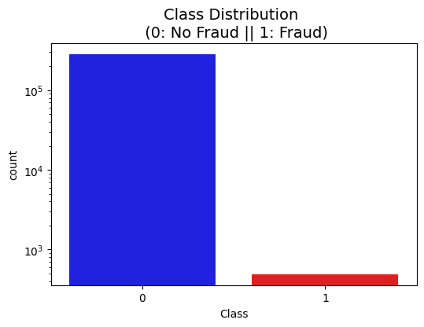
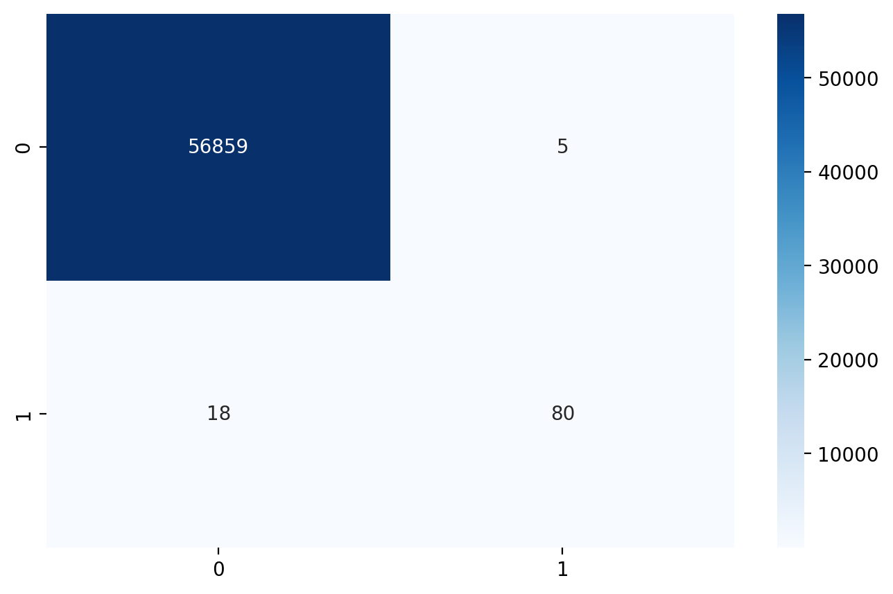

# 💳 Credit Card Fraud Detection System

[](https://credit-card-fraud-detection-144.streamlit.app/)


## 📌 Project Overview
This project is an end-to-end machine learning pipeline for detecting fraudulent credit card transactions. It addresses the challenge of **highly imbalanced data** (0.17% fraud rate) using advanced preprocessing and threshold tuning.

**Key Feature:** An interactive **Streamlit Dashboard** that allows users to adjust the decision threshold in real-time and visualize how it impacts Precision (Trust) and Recall (Catch Rate).

## 🚀 Live Demo
Try the interactive dashboard here:  
👉 **[Click to Launch App](https://credit-card-fraud-detection-144.streamlit.app/)**

## 📊 The Data
- **Dataset:** [Kaggle - Credit Card Fraud Detection](https://www.kaggle.com/datasets/mlg-ulb/creditcardfraud)
- **Size:** 284,807 transactions
- **Imbalance:** 492 Fraud (0.17%) vs. 284,315 Legitimate (99.83%)

### Class Imbalance

*(The dataset is heavily skewed, requiring techniques like Class Weighting to solve.)*

## ⚙️ Methodology
1. **Preprocessing:** - `RobustScaler` applied to **Amount** to handle extreme outliers.
   - `StandardScaler` applied to **Time**.
2. **Resampling Strategy:** Used `stratified` splitting to ensure the test set maintains the 0.17% fraud ratio.
3. **Model Training:** Trained Logistic Regression, Random Forest, and XGBoost with `class_weight='balanced'`.

## 🏆 Model Comparison (Leaderboard)
We evaluated three models to find the best balance between catching fraud (Recall) and minimizing false alarms (Precision).

| Model | Recall (Catch Rate) | Precision (Trust) | F1 Score |
| :--- | :--- | :--- | :--- |
| **Logistic Regression** | **91.8%** | 6.0% ❌ | 11.4% |
| **XGBoost** | 82.7% | 89.0% | **85.7%** |
| **Random Forest (Base)** | 75.5% | **96.1%** ✅ | 84.6% |

**Analysis:**
- **Logistic Regression** caught the most fraud but flagged too many innocent people (Low Precision).
- **Random Forest** was the most precise but missed some fraud.
- **Decision:** We chose **Random Forest** as the final model and optimized its decision threshold to improve its Recall.

## 🚀 Final Results (Tuned Random Forest)
By lowering the decision threshold from **0.5** to **0.3**, we significantly boosted the Catch Rate while keeping False Alarms low.

| Metric | Score (Class 1: Fraud) | Interpretation |
| :--- | :--- | :--- |
| **Recall** | **0.82** | We catch 82% of all fraud cases. |
| **Precision** | **0.94** | When we flag a transaction, we are 94% accurate. |
| **F1-Score** | **0.87** | Excellent balance between the two. |

### Confusion Matrix (Threshold = 0.3)


## 🛠️ Installation & Usage

### 1. Clone the Repository
```bash
git clone [https://github.com/YOUR-USERNAME/Credit-Card-Fraud-Detection.git](https://github.com/YOUR-USERNAME/Credit-Card-Fraud-Detection.git)
cd Credit-Card-Fraud-Detection

```

### 2. Install Dependencies

```bash
pip install -r requirements.txt

```

### 3. Launch the Dashboard

```bash
streamlit run app.py

```

## 📂 Project Structure

```text
Credit-Card-Fraud-Detection/
│
├── app.py                # Streamlit Dashboard application
├── main.ipynb            # Exploratory Data Analysis (EDA) & Experiments
├── requirements.txt      # Python dependencies
├── README.md             # Project documentation
├── creditcard.csv        # Dataset (Not included in repo, download from Kaggle)
│
├── models/               # Saved models (generated by train.py)
│   ├── model_rf.joblib
│   ├── model_xgb.joblib
│   └── model_lr.joblib
│
└── images/               # Screenshots for README
    ├── confusion_matrix.png
    └── class_imbalance.png

```

## 📬 Contact

**Sarthak Jain** - [LinkedIn Profile](https://www.linkedin.com/in/sarthak-jain-07812328b/) | [GitHub Profile](github.com/sarthak-144/)

